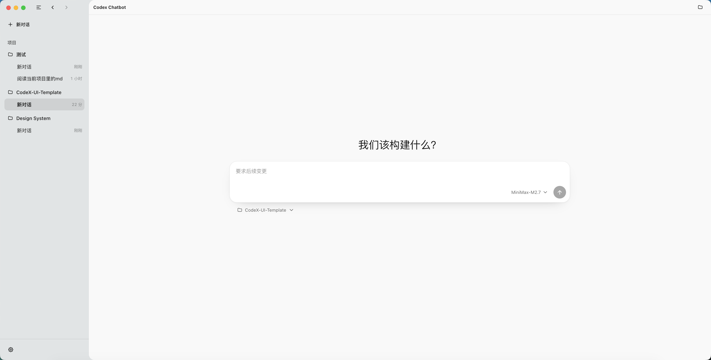
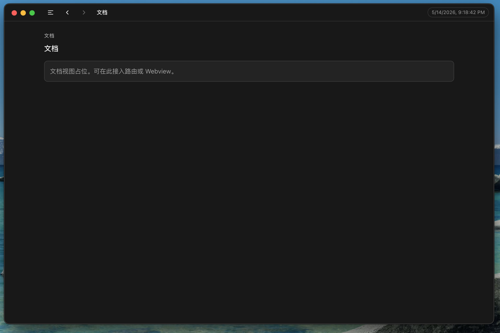

# CodeX-UI-Template

基于 **Electron + Vite + TypeScript** 的桌面端应用模板，预置类似「工作台」的 **App Shell**（侧栏、工作区标题栏、深浅主题、Hash 视图切换），并在 **macOS** 上采用隐藏式标题栏、透明窗口与 `vibrancy: under-window`，便于在此基础上扩展为类 Codex 风格的桌面 UI。





## 功能概览

- **Electron 30** + **Vite 5**，主进程 / 预加载 / 渲染进程由 `vite-plugin-electron` 串联开发与构建。
- **macOS**：`titleBarStyle: hiddenInset`、交通灯区域可拖拽；透明窗口 + 侧栏区域透出系统 material；工作区为不透明白底（见 `electron/main.ts`）。
- **渲染层**：侧栏导航（概览 / 文档）、工具栏（侧栏折叠、前进后退占位）、主题切换（`localStorage` 键 `CodeX-UI-Template-theme`）、`#docs` / `#settings` Hash 路由占位。
- **IPC**：主进程在页面加载完成后向渲染进程发送时间戳；预加载通过 `contextBridge` 暴露 `window.desktop` 与 `window.ipcRenderer`（见 `electron/preload.ts`）。
- **安全区**：`src/window-safe-area.ts` 将窗口控件安全区同步到 CSS 变量，适配自定义标题栏布局。

## 环境要求

- Node.js 18+（建议 LTS）
- npm 或兼容的包管理器

## 快速开始

```bash
npm install
npm run dev
```

开发模式下会启动 Vite 开发服务器并打开 Electron 窗口。

## Claude Agent 配置

Claude Agent SDK 放在 Electron 主进程中运行，所以环境变量写在项目根目录的 `.env.local`，不要写成 `VITE_*` 渲染层变量。可以从 `.env.example` 复制一份：

```bash
cp .env.example .env.local
```

可用变量：

| 变量 | 说明 |
| --- | --- |
| `ANTHROPIC_API_KEY` | Claude API Key |
| `ANTHROPIC_BASE_URL` | 自定义 Anthropic 兼容 Base URL |
| `ANTHROPIC_MODEL` | 默认模型，会传给 Claude Agent SDK 的 `model` 选项 |
| `ANTHROPIC_AUTH_TOKEN` | 可选，使用 token 鉴权时替代 API Key |

应用内也可以在「设置」页填写 API Key、Base URL、Model，并选择「设置页优先」或「环境变量」。默认是设置页优先：表单里的非空值会覆盖同名环境变量，空字段继续沿用 `.env.local` / 系统环境变量。

## 脚本说明

| 命令 | 说明 |
| --- | --- |
| `npm run dev` | 启动 Vite + Electron 开发环境 |
| `npm run build` | 执行 `tsc`、Vite 生产构建，并调用 **electron-builder** 打安装包 |
| `npm run preview` | 仅预览 Vite 构建后的静态资源（不启动 Electron） |

构建产物：`dist`（渲染层）、`dist-electron`（主进程与预加载）；安装包输出目录见 `electron-builder.json5` 中的 `directories.output`（默认 `release/${version}`）。

## 项目结构

```text
├── electron/           # 主进程与预加载
│   ├── main.ts         # 窗口创建、生命周期
│   └── preload.ts      # contextBridge 暴露 API
├── src/                # 渲染进程
│   ├── main.ts         # 入口
│   ├── components/     # AppShell / Chat / Docs / Settings 组件
│   ├── icons.ts        # 统一 SVG icon 出口
│   ├── style.css
│   ├── counter.ts      # 示例交互
│   └── window-safe-area.ts
├── public/             # 静态资源
├── index.html
├── vite.config.ts
├── electron-builder.json5
├── tsconfig.json
└── codex-ui-framework-notes.md   # Codex 类桌面 UI 分层说明（参考笔记，非官方文档）
```

## 打包与发布

1. 在 `electron-builder.json5` 中修改 **`appId`**、**`productName`** 等与品牌一致的字段。
2. 按需调整各平台 `mac` / `win` / `linux` 的 `target` 与签名、公证等（详见 [electron-builder 文档](https://www.electron.build/)）。
3. 执行 `npm run build`。

## 技术栈

- [Electron](https://www.electronjs.org/)
- [Vite](https://vitejs.dev/)
- [vite-plugin-electron](https://github.com/electron-vite/vite-plugin-electron)
- [electron-builder](https://www.electron.build/)
- TypeScript

## 许可证

[MIT](LICENSE)。使用前可按需在 `LICENSE` 第二行将版权归属改为你的名字或组织。
