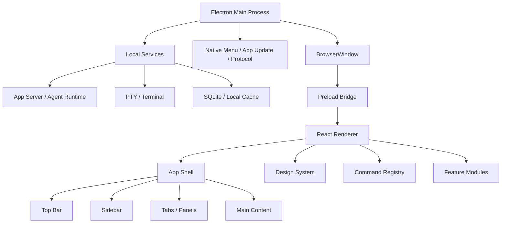

# Codex App UI 框架拆解与自建方案

> 本文基于本机安装包 `/Applications/Codex.app` 可见的打包产物整理。它不是 OpenAI 内部源码说明，也不会复刻未公开实现；文中的「观察到」指从已安装应用的 `Info.plist`、`app.asar`、bundle 文件名、依赖和压缩后的结构中能确认的信息。「建议实现」是给你自己搭 UI 框架时可直接采用的工程蓝图。

## 1. 一句话结论

Codex App 的 UI 不是一个单纯的网页，也不是原生 App。它更像一个「Electron 桌面外壳 + React/Vite Web 渲染层 + 设计 token 系统 + 命令/快捷键系统 + 本地服务桥」组合出来的桌面级工作台。

你要做类似的 UI 框架，核心不是先做很多按钮组件，而是先把这五层定下来：

1. 桌面窗口层：负责窗口、标题栏、系统按钮、安全区、IPC、菜单、更新、权限。
2. App Shell 层：负责侧边栏、顶部栏、面板、标签页、主内容区、布局动画。
3. Design System 层：负责 token、主题、按钮、菜单、弹窗、tooltip、图标、输入控件。
4. Command 层：负责命令 id、快捷键、菜单项、按钮、命令面板统一触发。
5. Runtime Bridge 层：负责 renderer 和本地服务、终端、文件系统、后台 agent 之间通信。

## 2. 已观察到的 Codex App 事实

安装包位置：

```text
/Applications/Codex.app
```

能确认的关键内容：

```text
Contents/Frameworks/Electron Framework.framework
Contents/Resources/app.asar
Contents/Resources/app.asar.unpacked
Contents/Resources/codex
Contents/Resources/node
Contents/Resources/node_repl
```

`Info.plist` 中能看到：

```text
CFBundleIdentifier = com.openai.codex
CFBundleShortVersionString = 26.506.31421
CFBundleExecutable = Codex
CFBundleIconFile = electron.icns
NSPrincipalClass = AtomApplication
ElectronAsarIntegrity.Resources/app.asar = SHA256(...)
```

`package.json` 中能看到：

```text
name = openai-codex-electron
productName = Codex
main = .vite/build/bootstrap.js
electron = 41.2.0
vite = 8.0.3
vitest = 4.1.5
@electron-forge/* = 7.11.1
better-sqlite3
node-pty
objc-js
ws
zod
@sentry/electron
```

renderer 里能看到这些明显模块：

```text
webview/assets/app-shell-*.js
webview/assets/app-main-*.css
webview/assets/button-*.js
webview/assets/tooltip-*.js
webview/assets/dialog-*.js
webview/assets/dropdown-*.js
webview/assets/command-keybindings-*.js
webview/assets/sidebar-signals-*.js
webview/assets/use-window-controls-safe-area-*.js
webview/assets/react-dom-*.js
webview/assets/floating-ui.react-dom-*.js
webview/assets/tailwind-styled-components.esm-*.js
```

这说明 Codex 的 UI 大概率是：

```text
Electron main process
  -> preload / sandbox preload
  -> Vite-built React renderer
  -> CSS token + utility class system
  -> local app server / CLI / native modules
```

## 3. 总体架构

可以把 Codex 类 UI 想成下面这个结构：



你的框架也建议按这个分层，不要把 Electron API、业务状态、按钮样式和页面逻辑混在一起。

## 4. Electron 窗口层

### 4.1 macOS 标题栏

Codex 在 macOS 主窗口上观察到类似配置：

```ts
new BrowserWindow({
  titleBarStyle: "hiddenInset",
  trafficLightPosition: { x: 16, y: 16 },
});
```

效果：

- 原生红黄绿按钮还在。
- 系统标题栏隐藏/内嵌。
- Web 内容可以画到标题栏区域。
- 应用自己画左上角的 sidebar、back、forward 按钮。

如果窗口需要毛玻璃或系统 vibrancy，macOS 可加：

```ts
new BrowserWindow({
  titleBarStyle: "hiddenInset",
  vibrancy: "menu",
  trafficLightPosition: { x: 16, y: 16 },
});
```

### 4.2 Windows / Linux 标题栏

Codex 对 Windows 观察到会走 `titleBarOverlay` 一类方案。你可以这样设计：

```ts
new BrowserWindow({
  frame: false,
  titleBarStyle: "hidden",
  titleBarOverlay: {
    color: "#ffffff",
    symbolColor: "#111111",
    height: 46,
  },
});
```

Linux 通常保守一些，使用默认标题栏或自己处理安全区，因为不同桌面环境差异很大。

### 4.3 拖拽区和可点击区

Electron 无边框/隐藏标题栏窗口里，Web 内容默认不能拖动窗口。需要 CSS：

```css
.draggable {
  -webkit-app-region: drag;
}

.no-drag,
.draggable button,
.draggable input,
.draggable textarea,
.draggable select {
  -webkit-app-region: no-drag;
}
```

规则很重要：

- 顶部栏背景区域加 `draggable`。
- 所有按钮、输入框、菜单触发器加 `no-drag`。
- 如果按钮在拖拽区里但没有 `no-drag`，按钮会点不动。
- 拖拽区会吞掉 pointer events，所以交互控件必须明确排除。

Codex 的 CSS 中能看到等价的工具类：

```text
.draggable -> -webkit-app-region: drag
.no-drag  -> -webkit-app-region: no-drag
```

## 5. 顶部栏与窗口安全区

Codex 有一个 `use-window-controls-safe-area` 相关模块。它要解决的问题是：Web 顶部栏不能挡住 macOS 红黄绿按钮，也不能挡住 Windows 的系统控制按钮。

建议自己实现一个 hook：

```ts
type SafeArea = {
  left: number;
  right: number;
};

export function getWindowControlsSafeArea(): SafeArea {
  if (typeof navigator !== "undefined") {
    const overlay = (navigator as any).windowControlsOverlay;
    if (overlay?.visible) {
      const rect = overlay.getTitlebarAreaRect();
      return {
        left: Math.max(0, Math.round(rect.x)),
        right: Math.max(
          0,
          Math.round(window.innerWidth - (rect.x + rect.width)),
        ),
      };
    }
  }

  const ua = navigator.userAgent.toLowerCase();

  if (ua.includes("mac")) {
    return { left: 76, right: 0 };
  }

  if (ua.includes("win")) {
    return { left: 0, right: 0 };
  }

  if (ua.includes("linux")) {
    return { left: 0, right: 120 };
  }

  return { left: 0, right: 0 };
}
```

把它写进 CSS 变量：

```ts
function applySafeArea(area: SafeArea) {
  document.documentElement.style.setProperty(
    "--spacing-token-safe-header-left",
    `${area.left}px`,
  );
  document.documentElement.style.setProperty(
    "--spacing-token-safe-header-right",
    `${area.right}px`,
  );
}
```

CSS 使用：

```css
.app-titlebar {
  padding-left: var(--spacing-token-safe-header-left);
  padding-right: var(--spacing-token-safe-header-right);
}
```

Codex CSS 中能看到这些同类变量：

```text
--spacing-token-safe-header-left
--spacing-token-safe-header-right
--height-toolbar
--height-toolbar-sm
--height-toolbar-pane
```

Codex 观察到的 toolbar 高度大致是：

```text
--height-toolbar: 46px
--height-toolbar-sm: 36px
--height-toolbar-pane: 40px
```

## 6. App Shell 层

App Shell 是这个 UI 框架最重要的一层。它不是某个页面，而是所有页面共享的桌面工作台框架。

建议结构：

```tsx
export function AppShell() {
  return (
    <div className="app-shell">
      <TopBar />
      <Sidebar />
      <MainViewport />
      <FloatingPanels />
      <ToastLayer />
      <ModalLayer />
    </div>
  );
}
```

### 6.0 变种：无全宽顶栏 + 左侧系统磨砂（macOS）

部分产品（尤其类 Chat 工作台）**没有横跨整窗的顶栏**：左侧栏与右侧主内容都顶到窗口上沿；**交通灯叠在左侧**透明/磨砂区域上；**右侧**仅在主内容列顶部有自己的标题栏（拖拽区可用中间「空白条」实现）。左侧若要做「透出桌面壁纸」的观感，需走 **BrowserWindow `transparent: true` + `vibrancy`（如 `under-window`）**，右侧工作区用**不透明白底**盖住，避免整窗发灰；Web 侧用 `data-*` 或 preload 标记以便在开启 vibrancy 时关掉侧栏的 `backdrop-filter`，避免与原生 material 叠两层。

### 6.1 顶部栏布局

Codex 顶部栏可以抽象为：

```text
TopBar
  start slot: sidebar toggle, back, forward
  center slot: tab title / project / route context
  end slot: status, updates, settings, overflow
```

推荐实现：

```tsx
type HeaderAction = {
  id: string;
  align: "start" | "center" | "end";
  order?: number;
  element: React.ReactNode;
};

export function TopBar({ actions }: { actions: HeaderAction[] }) {
  const start = actions
    .filter((x) => x.align === "start")
    .sort(byOrder);
  const center = actions
    .filter((x) => x.align === "center")
    .sort(byOrder);
  const end = actions
    .filter((x) => x.align === "end")
    .sort(byOrder);

  return (
    <header className="app-header app-header-tint draggable">
      <div className="app-header-left no-drag">{start.map(renderAction)}</div>
      <div className="app-header-center no-drag">{center.map(renderAction)}</div>
      <div className="app-header-right no-drag">{end.map(renderAction)}</div>
    </header>
  );
}
```

CSS：

```css
.app-header {
  position: fixed;
  inset-inline: 0;
  top: 0;
  z-index: 30;
  display: flex;
  align-items: center;
  height: var(--height-toolbar);
  min-width: 0;
  background: var(--codex-titlebar-tint, transparent);
  padding-left: var(--spacing-token-safe-header-left);
  padding-right: var(--spacing-token-safe-header-right);
}

.app-header-left,
.app-header-center,
.app-header-right {
  display: flex;
  align-items: center;
  gap: 4px;
  min-width: 0;
}

.app-header-center {
  flex: 1;
  justify-content: center;
}
```

### 6.2 红框里的三个按钮

你截图里的三个按钮，本质上就是：

```text
Toggle sidebar
Navigate back
Navigate forward
```

Codex 的打包代码里能看到这些命令 id：

```text
toggleSidebar
navigateBack
navigateForward
```

UI 上的做法：

```tsx
function ShellNavigationControls() {
  const canGoBack = useCanGoBack();
  const canGoForward = useCanGoForward();

  return (
    <div className="flex items-center gap-1 no-drag">
      <ToolbarButton
        ariaLabel="Toggle sidebar"
        tooltip="Toggle sidebar"
        command="toggleSidebar"
        icon={<SidebarIcon className="icon-xs" />}
      />
      <ToolbarButton
        ariaLabel="Back"
        tooltip="Back"
        command="navigateBack"
        disabled={!canGoBack}
        icon={<ArrowLeftIcon className="icon-xs" />}
      />
      <ToolbarButton
        ariaLabel="Forward"
        tooltip="Forward"
        command="navigateForward"
        disabled={!canGoForward}
        icon={<ArrowLeftIcon className="icon-xs scale-x-[-1]" />}
      />
    </div>
  );
}
```

重点：

- forward 可以复用 left arrow，水平翻转。
- disabled 时降低透明度，并保留尺寸。
- tooltip 里显示快捷键。
- 点击按钮不要直接写业务逻辑，统一派发 command。

## 7. Design Token 系统

Codex 的 CSS 是明显 token 化的。能看到这些类型：

```text
--font-sans
--font-mono
--spacing
--height-toolbar
--height-token-nav-row
--padding-panel
--padding-toolbar
--color-token-foreground
--color-token-text-primary
--color-token-text-secondary
--color-token-border
--color-token-button-background
--color-token-input-background
--color-token-list-hover-background
--color-token-main-surface-primary
```

建议你按三层 token 设计：

### 7.1 Primitive token

最底层，描述原始值：

```css
:root {
  --gray-0: #ffffff;
  --gray-50: #f9f9f9;
  --gray-100: #ededed;
  --gray-500: #5d5d5d;
  --gray-900: #181818;

  --blue-400: #0285ff;
  --red-500: #e02e2a;
  --green-500: #00a240;

  --spacing: 0.25rem;

  --text-xs: 11px;
  --text-sm: 12px;
  --text-base: 14px;
  --text-lg: 16px;
  --text-xl: 28px;

  --radius-sm: 4px;
  --radius-md: 6px;
  --radius-lg: 8px;
}
```

### 7.2 Semantic token

中间层，描述含义：

```css
:root {
  --color-bg-primary: var(--gray-0);
  --color-bg-secondary: var(--gray-50);
  --color-text-primary: var(--gray-900);
  --color-text-secondary: color-mix(in oklab, var(--gray-900) 65%, transparent);
  --color-border: color-mix(in oklab, var(--gray-900) 8%, transparent);
  --color-focus-border: var(--blue-400);
}

[data-theme="dark"] {
  --color-bg-primary: var(--gray-900);
  --color-bg-secondary: #212121;
  --color-text-primary: var(--gray-0);
  --color-text-secondary: color-mix(in oklab, var(--gray-0) 65%, transparent);
  --color-border: color-mix(in oklab, var(--gray-0) 12%, transparent);
}
```

### 7.3 Component token

组件层，描述具体控件：

```css
:root {
  --button-bg: var(--color-bg-secondary);
  --button-fg: var(--color-text-primary);
  --button-border: var(--color-border);

  --toolbar-height: 46px;
  --toolbar-height-sm: 36px;
  --panel-padding: calc(var(--spacing) * 3);
}
```

不要在组件里直接写颜色。组件只吃 token。

## 8. Utility CSS 层

Codex 的 CSS 里能看到类似 Tailwind 的工具类：

```text
flex
items-center
gap-1
min-w-0
h-toolbar
h-toolbar-sm
icon-xs
text-token-text-secondary
bg-token-list-hover-background
rounded
```

建议做两类 CSS：

1. 手写全局 token 和语义工具类。
2. 用 Tailwind 或 UnoCSS 生成常用布局工具类。

推荐配置思路：

```ts
// tailwind.config.ts
export default {
  theme: {
    extend: {
      spacing: {
        toolbar: "var(--height-toolbar)",
        "toolbar-sm": "var(--height-toolbar-sm)",
      },
      colors: {
        token: {
          foreground: "var(--color-token-foreground)",
          border: "var(--color-token-border)",
          "text-primary": "var(--color-token-text-primary)",
          "text-secondary": "var(--color-token-text-secondary)",
        },
      },
    },
  },
};
```

如果不想引入 Tailwind，至少自己提供这些工具：

```css
.h-toolbar { height: var(--height-toolbar); }
.h-toolbar-sm { height: var(--height-toolbar-sm); }
.icon-xs { width: 16px; height: 16px; }
.icon-sm { width: 18px; height: 18px; }
.icon-md { width: 24px; height: 24px; }
.text-token-secondary { color: var(--color-token-text-secondary); }
.bg-token-hover { background: var(--color-token-list-hover-background); }
```

## 9. Button 组件

Codex 的按钮组件能观察到这些设计点：

```text
color: primary / secondary / ghost ...
size: default / toolbar ...
uniform: true 时做等宽等高 icon button
loading: true 时显示 spinner
disabled: true 时禁用
默认带 no-drag
默认带 focus outline
默认 user-select-none
```

建议 API：

```tsx
type ButtonProps = React.ButtonHTMLAttributes<HTMLButtonElement> & {
  color?: "primary" | "secondary" | "ghost" | "danger";
  size?: "sm" | "default" | "toolbar";
  uniform?: boolean;
  loading?: boolean;
};

export function Button({
  color = "primary",
  size = "default",
  uniform = false,
  loading = false,
  disabled,
  className,
  children,
  ...props
}: ButtonProps) {
  return (
    <button
      {...props}
      disabled={disabled || loading}
      className={cx(
        "no-drag user-select-none cursor-interaction inline-flex items-center gap-1 border whitespace-nowrap focus:outline-none disabled:cursor-not-allowed disabled:opacity-40",
        buttonSize[size],
        buttonColor[color],
        uniform && "aspect-square justify-center px-0",
        className,
      )}
    >
      {loading && <Spinner className="icon-xxs" />}
      {children}
    </button>
  );
}
```

Toolbar button：

```tsx
export function ToolbarButton({
  icon,
  ariaLabel,
  tooltip,
  command,
  disabled,
}: {
  icon: React.ReactNode;
  ariaLabel: string;
  tooltip: React.ReactNode;
  command: string;
  disabled?: boolean;
}) {
  const shortcut = useCommandShortcut(command);

  return (
    <Tooltip content={tooltip} shortcut={shortcut}>
      <Button
        aria-label={ariaLabel}
        title={ariaLabel}
        color="ghost"
        size="toolbar"
        uniform
        disabled={disabled}
        onClick={() => dispatchCommand(command)}
      >
        {icon}
      </Button>
    </Tooltip>
  );
}
```

CSS：

```css
.btn-toolbar {
  width: 32px;
  height: 32px;
  border-radius: 6px;
}

.btn-ghost {
  color: var(--color-token-text-secondary);
  background: transparent;
  border-color: transparent;
}

.btn-ghost:hover {
  color: var(--color-token-text-primary);
  background: var(--color-token-list-hover-background);
}
```

## 10. Command / 快捷键系统

Codex 的 UI 明显把按钮点击和命令系统解耦。观察到的命令包括：

```text
toggleSidebar
navigateBack
navigateForward
```

你应该设计一个 command registry：

```ts
type Command = {
  id: string;
  title: string;
  when?: () => boolean;
  run: () => void | Promise<void>;
  shortcut?: string;
};

const commands = new Map<string, Command>();

export function registerCommand(command: Command) {
  commands.set(command.id, command);
}

export function dispatchCommand(id: string) {
  const command = commands.get(id);
  if (!command) return;
  if (command.when && !command.when()) return;
  return command.run();
}

export function getCommandShortcut(id: string) {
  return commands.get(id)?.shortcut;
}
```

注册：

```ts
registerCommand({
  id: "toggleSidebar",
  title: "Toggle sidebar",
  shortcut: "Cmd+B",
  run: () => shellStore.toggleSidebar(),
});

registerCommand({
  id: "navigateBack",
  title: "Back",
  shortcut: "Cmd+[",
  when: () => router.canGoBack(),
  run: () => router.back(),
});

registerCommand({
  id: "navigateForward",
  title: "Forward",
  shortcut: "Cmd+]",
  when: () => router.canGoForward(),
  run: () => router.forward(),
});
```

好处：

- 菜单、按钮、命令面板、快捷键都调用同一个命令。
- disabled 状态可以来自 `when()`。
- tooltip 可以自动显示快捷键。
- 后续做可配置快捷键更容易。

## 11. State 管理

Codex bundle 中能看到多个 `signals` 相关模块，例如 sidebar、app server manager、intl 等。说明它会把全局状态拆成很多小信号，而不是所有东西塞进一个 React context。

建议分层：

```text
shellStore
  sidebarOpen
  activePanel
  activeTab
  headerActions
  safeArea

navigationStore
  history
  canGoBack
  canGoForward

connectionStore
  appServerState
  remoteConnectionState
  authState

themeStore
  theme
  highContrast
  reducedMotion

commandStore
  registeredCommands
  keybindings
```

技术选择：

- 小框架：Zustand。
- 更细粒度：Jotai / Valtio / Signals。
- 服务端数据：TanStack Query。
- 本地持久化：SQLite / IndexedDB / localStorage，根据桌面能力选择。

原则：

- UI 布局状态可以即时 signal 化。
- 远程请求状态交给 query cache。
- IPC 返回的数据不要直接进 React 组件，先经过 store adapter。
- 命令执行只改 store，不直接操作 DOM。

## 12. 主题系统

Codex 的 token 命名很接近 VS Code 主题模型，例如：

```text
--vscode-foreground
--vscode-editor-font-family
--vscode-tab-selectedBackground
--vscode-editorPane-background
```

这说明它可能兼容或借鉴了 VS Code 的主题变量体系。你可以这么做：

```css
:root {
  --color-token-foreground: var(--vscode-foreground, #181818);
  --color-token-editor-background: var(--vscode-editor-background, #ffffff);
  --color-token-border: color-mix(
    in oklab,
    var(--color-token-foreground) 8%,
    transparent
  );
}
```

这样你的 App 可以同时支持：

- 自己的默认主题。
- 系统浅色/深色。
- VS Code 风格主题映射。
- 高对比度模式。

建议主题文件结构：

```text
src/ui/theme/
  primitives.css
  semantic.css
  light.css
  dark.css
  high-contrast.css
  vscode-adapter.css
```

## 13. 国际化与可访问性

Codex 的 bundle 中有大量 locale 文件和 `formatMessage` 风格文案。按钮的 aria label、tooltip、dialog 文案都有 id 和 default message。

你的框架要从第一天做这些：

```tsx
const label = intl.formatMessage({
  id: "app.sidebar.toggle",
  defaultMessage: "Toggle sidebar",
});

return (
  <ToolbarButton
    ariaLabel={label}
    tooltip={label}
    command="toggleSidebar"
    icon={<SidebarIcon />}
  />
);
```

规则：

- 所有 icon button 必须有 `aria-label`。
- tooltip 不能替代 aria label。
- disabled 控件仍应保持布局尺寸。
- 弹窗要有 title、focus trap、Esc 关闭策略。
- 顶部拖拽区不要包住可输入区域。
- reduced motion 下关闭大部分动画。

CSS：

```css
@media (prefers-reduced-motion: reduce) {
  *,
  *::before,
  *::after {
    animation-duration: 0.01ms !important;
    animation-iteration-count: 1 !important;
    scroll-behavior: auto !important;
    transition-duration: 0.01ms !important;
  }
}
```

## 14. 面板与布局动画

Codex 里有 `app-shell-panel-animation`、主内容 viewport、left panel container query 等线索。说明它不是简单 flex，而是对面板开合、边缘滚动、内容 top inset 做了系统设计。

建议你的 Shell 用这些布局变量：

```css
:root {
  --height-toolbar: 46px;
  --width-sidebar: clamp(240px, 300px, min(520px, calc(100vw - 320px)));
  --main-content-top-inset: calc(var(--height-toolbar) + var(--spacing) * 8);
}

.app-shell {
  width: 100vw;
  height: 100vh;
  overflow: hidden;
  background: var(--color-token-main-surface-primary);
  color: var(--color-token-text-primary);
}

.app-body {
  display: grid;
  grid-template-columns: var(--width-sidebar) minmax(0, 1fr);
  height: 100%;
  min-height: 0;
}

.app-main {
  container: app-main / inline-size;
  min-width: 0;
  min-height: 0;
  overflow: auto;
  padding-top: var(--height-toolbar);
}
```

面板动画：

```css
.panel-animated [data-panel] {
  will-change: flex-grow, max-width;
  transition:
    flex-grow var(--transition-duration-relaxed) var(--transition-ease-basic),
    max-width var(--transition-duration-relaxed) var(--transition-ease-basic);
}

.panel-animated.panel-dragging [data-panel] {
  transition: none;
}
```

## 15. 桌面 Runtime Bridge

Codex 不只是 UI。它要跑终端、agent、本地服务、文件系统、浏览器插件等，所以 renderer 不能直接拿 Node 全权限，应该经过 preload 暴露窄接口。

建议：

```ts
// preload.ts
contextBridge.exposeInMainWorld("desktop", {
  invoke: (channel: string, payload?: unknown) => ipcRenderer.invoke(channel, payload),
  on: (channel: string, cb: (payload: unknown) => void) => {
    const listener = (_event: unknown, payload: unknown) => cb(payload);
    ipcRenderer.on(channel, listener);
    return () => ipcRenderer.off(channel, listener);
  },
});
```

renderer：

```ts
export async function callDesktop<T>(channel: string, payload?: unknown): Promise<T> {
  return window.desktop.invoke(channel, payload);
}
```

main：

```ts
ipcMain.handle("terminal:create", async (_event, options) => {
  return terminalService.create(options);
});

ipcMain.handle("workspace:openFile", async (_event, path) => {
  return workspaceService.openFile(path);
});
```

安全原则：

- renderer 不能直接访问 `fs`、`child_process`。
- preload 只暴露白名单 API。
- 每个 IPC handler 做参数校验，推荐用 `zod`。
- 命令执行、文件写入、网络访问要有权限模型。

## 16. 推荐目录结构

你可以照这个搭：

```text
src/
  main/
    app.ts
    create-window.ts
    menu.ts
    ipc.ts
    services/
      terminal-service.ts
      workspace-service.ts
      app-server-service.ts
      update-service.ts

  preload/
    index.ts
    desktop-api.ts

  renderer/
    app.tsx
    routes.tsx

    shell/
      AppShell.tsx
      TopBar.tsx
      Sidebar.tsx
      MainViewport.tsx
      PanelLayout.tsx
      useWindowControlsSafeArea.ts

    ui/
      Button.tsx
      ToolbarButton.tsx
      Tooltip.tsx
      Dialog.tsx
      Dropdown.tsx
      Tabs.tsx
      Toast.tsx
      icons.tsx

    commands/
      command-registry.ts
      keybindings.ts
      useCommand.ts

    state/
      shell-store.ts
      navigation-store.ts
      theme-store.ts
      connection-store.ts

    theme/
      primitives.css
      semantic.css
      utilities.css
      app-shell.css
```

## 17. 从零实现路线

### 第 1 步：Electron + Vite + React

```bash
pnpm create vite my-app --template react-ts
pnpm add -D electron @electron-forge/cli @electron-forge/plugin-vite
pnpm add zod
```

如果需要终端：

```bash
pnpm add node-pty
```

如果需要本地缓存：

```bash
pnpm add better-sqlite3
```

### 第 2 步：窗口配置

```ts
export function createMainWindow() {
  const win = new BrowserWindow({
    width: 1200,
    height: 800,
    minWidth: 860,
    minHeight: 560,
    titleBarStyle: process.platform === "darwin" ? "hiddenInset" : "hidden",
    trafficLightPosition:
      process.platform === "darwin" ? { x: 16, y: 16 } : undefined,
    titleBarOverlay:
      process.platform === "win32"
        ? { color: "#ffffff", symbolColor: "#111111", height: 46 }
        : undefined,
    webPreferences: {
      preload: path.join(__dirname, "preload.js"),
      contextIsolation: true,
      nodeIntegration: false,
      sandbox: true,
    },
  });

  return win;
}
```

### 第 3 步：CSS token

先写 token，不要先写页面。

```css
:root {
  --spacing: 0.25rem;
  --height-toolbar: 46px;
  --height-toolbar-sm: 36px;
  --height-toolbar-pane: 40px;
  --spacing-token-safe-header-left: 0px;
  --spacing-token-safe-header-right: 0px;

  --color-token-main-surface-primary: #ffffff;
  --color-token-text-primary: #181818;
  --color-token-text-secondary: rgb(24 24 24 / 0.65);
  --color-token-border: rgb(24 24 24 / 0.08);
  --color-token-list-hover-background: rgb(24 24 24 / 0.06);
  --color-token-focus-border: #0285ff;
}

[data-theme="dark"] {
  --color-token-main-surface-primary: #181818;
  --color-token-text-primary: #ffffff;
  --color-token-text-secondary: rgb(255 255 255 / 0.65);
  --color-token-border: rgb(255 255 255 / 0.12);
  --color-token-list-hover-background: rgb(255 255 255 / 0.08);
}
```

### 第 4 步：App Shell

```tsx
export function AppShell() {
  useInstallWindowControlsSafeArea();

  return (
    <div className="app-shell">
      <TopBar />
      <div className="app-body">
        <Sidebar />
        <main className="app-main">
          <Outlet />
        </main>
      </div>
    </div>
  );
}
```

### 第 5 步：Command 系统

先接入三个命令：

```text
toggleSidebar
navigateBack
navigateForward
```

等这套跑通，再接：

```text
newConversation
openSearch
openPlugins
openAutomations
openSettings
toggleDevTools
```

### 第 6 步：组件库

最小必备：

```text
Button
ToolbarButton
Tooltip
Dropdown
Dialog
Tabs
SidebarItem
Icon
Spinner
Toast
```

不要一开始做 50 个组件。先保证这几个组件：

- token 化
- 可访问
- 可禁用
- 可键盘操作
- 在 draggable 顶栏中可点击
- 深色模式正常

## 18. 质量标准

要做到 Codex 这种桌面质感，重点看这些细节：

1. 顶部栏不能抖动，按钮 disabled 不能改变布局。
2. macOS 红黄绿按钮周围要有安全区。
3. 所有 icon button 要有 tooltip 和 aria label。
4. 顶部栏空白区域可以拖动窗口。
5. 顶部栏按钮可以正常点击，不被 drag 区吞掉。
6. 面板开合要有动画，但拖拽调整尺寸时要关闭动画。
7. 主内容滚动时 header 背景可以根据边缘滚动状态变色。
8. CSS 全部走 token，不要在业务组件里写死颜色。
9. 命令 id 是稳定 API，不要把快捷键散落在组件里。
10. preload API 要窄，所有 main process 能力都要白名单。

## 19. 你可以直接采用的 MVP 范围

第一版 UI 框架建议只做这些：

```text
Electron window
  hidden titlebar
  safe area
  preload bridge

Renderer
  AppShell
  TopBar
  Sidebar
  MainViewport

Design system
  token.css
  Button
  ToolbarButton
  Tooltip
  Dialog
  Dropdown

Command system
  registerCommand
  dispatchCommand
  useCommandShortcut

State
  shellStore
  navigationStore
  themeStore
```

做到这里，你就已经有了一个类似 Codex 的 UI 框架骨架。

## 20. 最重要的设计判断

Codex 这类 UI 的高级感不来自复杂视觉，而来自系统一致性：

- 每个按钮都像同一个系统里长出来的。
- 每个空间尺寸都有 token。
- 每个操作都有 command id。
- 每个浮层都有统一 z-index、阴影、背景、focus 行为。
- 每个桌面平台都有自己的窗口安全区策略。
- UI 不直接知道底层怎么跑 agent，只通过 runtime bridge 交互。

你做自己的框架时，先把「壳、token、命令、桥」打牢，再往上加业务页面，会比直接堆页面稳很多。

